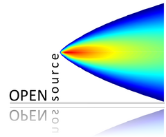

<!-- README.md is generated from README.Rmd. Please edit that file -->

```{r}
#| label: "setup"
#| include: FALSE
knitr::opts_chunk$set(
  collapse = TRUE,
  comment = "#>",
  fig.path = "man/figures/README-",
  out.width = "100%",
  warning = FALSE,
  message = FALSE,
  eval = FALSE,
  cache = TRUE
)
```

# deweather: remove meteorological variation from air quality data <a href="https://davidcarslaw.github.io/deweather/"></a>

<!-- badges: start -->
[](https://github.com/davidcarslaw/deweather/actions)
[](https://CRAN.R-project.org/package=deweather)
[](https://github.com/davidcarslaw/deweather/actions/workflows/R-CMD-check.yaml)
<!-- badges: end -->

**deweather** is an R package developed for the purpose of "removing" the influence of meteorology from air quality time series data. It is part of the [openair](http://davidcarslaw.github.io/openair/) suite of packages designed to support the analysis of air quality data and related data.

The **deweather** package uses a *boosted regression tree* approach for modelling air quality data. These and similar techniques provide powerful tools for building statistical models of air quality data. They are able to take account of the many complex interactions between variables as well as non-linear relationships between the variables.

The modelling can be computationally intensive and therefore **deweather** makes use of the parallel processing, which should work on Windows, Linux and Mac OSX.

## Installation

Installation of **deweather** from GitHub should be easy using the `{pak}` package. 

```{r}
#| label: "install"
# install.packages("pak")
pak::pak("davidcarslaw/deweather")
```

## Description

Meteorology plays a central role in affecting the concentrations of pollutants in the atmosphere. When considering trends in air pollutants it can be very difficult to know whether a change in concentration is due to emissions or meteorology.

The **deweather** package uses a powerful statistical technique based on *boosted regression trees* using the `{gbm}` package (Ridgeway, 2017). Statistical models are developed to explain concentrations using meteorological and other variables. These models can be tested on randomly withheld data with the aim of developing the most appropriate model.

## Example data set

The **deweather** package comes with a comprehensive data set of air quality and meteorological data. The air quality data is from Marylebone Road in central London (obtained from the `{openair}` package) and the meteorological data from Heathrow Airport (obtained from the `{worldmet}` package).

The `road_data` data frame contains various pollutants such a NO~x~, NO~2~, ethane and isoprene as well as meteorological data including wind speed, wind direction, relative humidity, ambient temperature and cloud cover. Code to obtain this data directly can be found [here](https://github.com/davidcarslaw/deweather/blob/master/data-raw/road_data.R).

```{r}
#| label: "load-pkg"
#| eval: TRUE
library(deweather)
head(road_data)
```

## Construct and test model(s)

The `testMod()` function is used to build and test various models to help derive the most appropriate.

In this example, we will restrict the data to model to 4 years. Note that variables such as `"hour"` and `"weekday"` are used as variables that can be used to explain some of the variation. `"hour"` for example very usefully acts as a proxy for the diurnal variation in emissions.

```{r}
#| label: "testMod"
#| eval: TRUE
#| fig.height: 4.5
#| fig.cap: "A statistical summary of a `{deweather}` model test."
#| fig.alt: "A scatter plot showing predicted nitrogen dioxide on the
#| x-axis and measured nitrogen dioxide on the y-axis. Alongside is a table
#| of statistical values describing the model performance, including R,
#| RMSE, NMGE, NMB, MGE, MB, FAC2 and n."
library(openair)
# select only part of the data set
dat_part <- selectByDate(road_data, year = 2001:2004)

# test a model with commonly used covariates
testMod(
  dat_part,
  vars = c("trend", "ws", "wd", "hour", "weekday", "air_temp", "week"),
  pollutant = "no2"
)
```

The output shows by default the performance of the model when applied to a withheld random 20% (by default) of the data, i.e., the model is evaluated against data not used to build the model. Common model evaluation metrics are also given.

## Build a model

Assuming that a good model can be developed, it can now be explored in more detail.

```{r}
#| label: "buildMod"
#| eval: TRUE
mod_no2 <- buildMod(
  dat_part,
  vars = c("trend", "ws", "wd", "hour", "weekday", "air_temp", "week"),
  pollutant = "no2",
  n.core = 6
)
```

This function returns a `deweather` object that can be interrogated as shown below.

## Examine the partial dependencies

### Plot all partial dependencies

One of the benefits of the boosted regression tree approach is that the *partial dependencies* can be explored. In simple terms, the partial dependencies show the relationship between the pollutant of interest and the covariates used in the model while holding the value of other covariates at their mean level.

```{r}
#| label: "plotAll"
#| eval: TRUE
#| fig.width: 7
#| fig.height: 11
#| fig.cap: "The 7 partial dependencies of the deweather model."
#| fig.alt: "Seven line charts showing the partial dependencies of the
#| deweather model. In order of influence: wind direction, hour of day,
#| long-term trend, weekday, wind speed, week of the year, and finally air
#| temperature."
plotPD(mod_no2, nrow = 4)
```

### Plot two-way interactions

It can be very useful to plot important two-way interactions. In this example the interaction between `"ws"` and `"air_temp"` is considered. The plot shows that NO~2~ tends to be high when the wind speed is low and the temperature is low, i.e., stable atmospheric conditions. Also NO~2~ tends to be high when the temperature is high, which is most likely due to more O~3~ available to convert NO to NO~2~. In fact, background O~3~ would probably be a useful covariate to add to the model.

```{r}
#| label: "plot2way"
#| eval: TRUE
#| fig.width: 5
#| fig.height: 4.5
#| fig.cap: "A two-way interaction plot showing the interaction between
#| wind speed and air temperature"
#| fig.alt: "A heatmap showing the interaction between air temperature and
#| wind speed in the deweather model. Nitrogen dioixde is shown to be high
#| when wind speed is low and temperature is either very low or above around
#| 25 degrees Celcius."
plot2Way(mod_no2, variable = c("ws", "air_temp"))
```

## Apply meteorological averaging

An indication of the meteorologically-averaged trend is given by the `plotAllPD()` function above. A better indication is given by using the model to predict many times with random sampling of meteorological conditions. This sampling is carried out by the `metSim()` function. Note that in this case there is no need to supply the `"trend"` component because it is calculated using `metSim()`.

```{r}
#| label: "metSim"
#| eval: TRUE
demet <- metSim(mod_no2,
  newdata = dat_part,
  metVars = c("ws", "wd", "hour", "weekday", "air_temp", "week")
)
```

Now it is possible to plot the resulting trend.

```{r}
#| label: "plotTrend"
#| eval: TRUE
#| fig.width: 7
#| fig.height: 3.5
#| fig.cap: "A deweathered nitrogen dioxide trend."
#| fig.alt: "A line chart with date on the x-axis and deweathered NO2 on
#| the y-axis. The trend is very noisy, but shows an increase in
#| concentrations in 2003."
library(ggplot2)
ggplot(demet, aes(date, no2)) +
  geom_line() +
  labs(y = quickText("Deweathered no2 (ug/m3)"))
```

The plot is rather noisy due to relatively few samples of meteorology being considered (200 by default, set with `B = 200`). The noise could be reduced by increasing the simulations, but this would add to run time. Alternatively, it can be useful to simply average the results. For example:

```{r}
#| label: "plotTrendAve"
#| eval: TRUE
#| fig.width: 7
#| fig.height: 3.5
#| fig.cap: "A time-averaged deweathered nitrogen dioxide trend."
#| fig.alt: "A line chart with date on the x-axis and deweathered NO2 on
#| the y-axis. The trend has been time averaged to show daily mean
#| concentrations, clearly illustrating a sharp increase in 2003."
library(ggplot2)
ggplot(timeAverage(demet, "day"), aes(date, no2)) +
  geom_line(col = "dodgerblue", size = 1) +
  labs(y = quickText("Deweathered NO2 (ug/m3)"))
```

## References

* Grange, S. K. and Carslaw, D. C. (2019) [Using meteorological normalisation to detect interventions in air quality time series](https://www.sciencedirect.com/science/article/pii/S004896971834244X), Science of The Total Environment. 653, pp. 578–588. doi: 10.1016/j.scitotenv.2018.10.344.

* Carslaw, D.C., Williams, M.L. and B. Barratt (2012) [A short-term intervention study — impact of airport closure on near-field air quality due to the eruption of Eyjafjallajökull](https://www.sciencedirect.com/science/article/abs/pii/S1352231012001355), Atmospheric Environment, Vol. 54, 328–336.

* Carslaw, D.C. and P.J. Taylor (2009). [Analysis of air pollution data at a mixed source location using boosted regression trees](https://www.sciencedirect.com/science/article/abs/pii/S1352231009003069), Atmospheric Environment.  Vol. 43, pp. 3563–3570.

* Greenwell B, Boehmke B, Cunningham J, Developers G (2022). _gbm: Generalized Boosted Regression Models_. R
  package version 2.1.8.1, <https://CRAN.R-project.org/package=gbm>.
