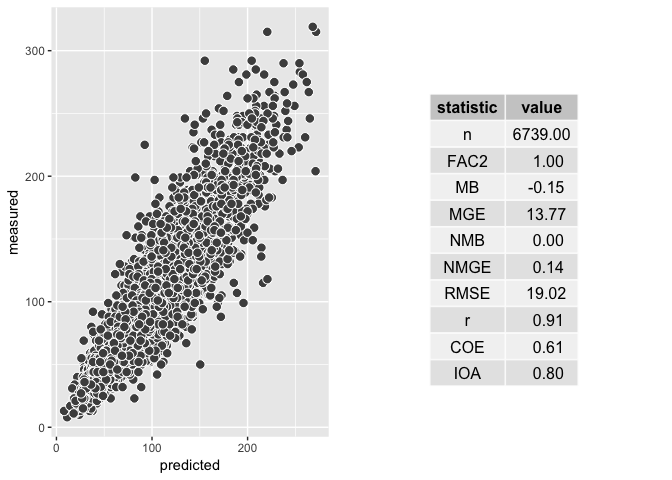
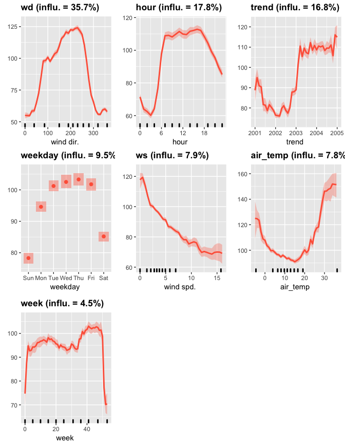
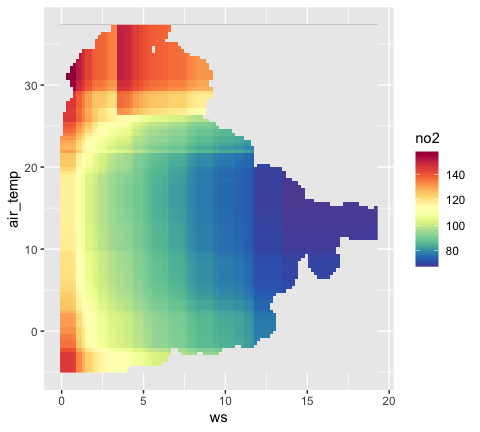

<!-- Edit the README.Rmd only!!! The README.md is generated automatically from README.Rmd. -->
deweather: an R package to remove meteorological variation from air quality data
================================================================================


**deweather** is an R package developed for the purpose of 'removing' the influence of meteorology from air quality time series data. It is part of the [openair](http://davidcarslaw.github.io/openair/) suite of packages designed to support the analysis of air quality data and related data.

The **deweather** package uses a *boosted regression tree* approach for modelling air quality data. These and similar techniques provide powerful tools for building statistical models of air quality data. They are able to take account of the many complex interactions between variables as well as non-linear relationships between the variables.

The modelling can be computationally intensive and therefore **deweather** makes use of the parallel processing, which should work on Windows, Linux and Mac OSX.

Installation
------------

Installation of **deweather** from GitHub should be easy using the devtools package.

``` r
require(devtools)
install_github('davidcarslaw/deweather')
```

Description
-----------

Meteorology play a central role in affecting the concentrations of pollutants in the atmosphere. When considering trends in air pollutants it can be very difficult to know whether a change in concentration is due to emissions or meteorology.

The **deweather** package uses a powerful statistical technique based on *boosted regression trees* using the **gbm** package (Ridgeway, 2017). Statistical models are developed to explain concentrations using meteorological and other variables. These models can be tested on randomly withheld data with the aim of developing the most appropriate model.

Example data set
----------------

The **deweather** package comes with a comprehensive data set of air quality and meteorological data. The air quality data is from Marylebone Road in central London (obtained from the **openair** package) and the meteorological data from Heathrow Airport (obtained from the **worldmet** package).

The `road_data` data frame contains various pollutants such a NOx, NO2, ethane and isoprene as well as meteorological data including wind speed, wind direction, relative humidity, ambient temperature and cloud cover.

``` r
library(deweather)
head(road_data)
##                  date nox no2 ethane isoprene benzene  ws  wd air_temp
## 1 1998-01-01 00:00:00 546  74     NA       NA      NA 1.0 280     3.60
## 2 1998-01-01 01:00:00  NA  NA     NA       NA      NA 1.0 230     3.50
## 3 1998-01-01 02:00:00  NA  NA     NA       NA      NA 1.5 180     4.25
## 4 1998-01-01 03:00:00 944  99     NA       NA      NA  NA  NA       NA
## 5 1998-01-01 04:00:00 894 149     NA       NA      NA 1.5 180     3.80
## 6 1998-01-01 05:00:00 506  80     NA       NA      NA 1.0 190     3.50
##         RH cl
## 1 89.41776  2
## 2 90.67753  2
## 3 87.60679  2
## 4       NA NA
## 5 89.43347  1
## 6 89.40989 NA
```

For those interested in obtaining the data directly, the following code can be used.

``` r
library(openair)
library(worldmet)
library(dplyr)

# import AQ data
road_data <- importAURN(site = "my1", year = 1998:2016, hc = TRUE)

# import met data
met <- importNOAA(year = 1998:2016)

# join together but ignore met data in road_data because it is modelled
road_data <- left_join(select(road_data, -ws, -wd), met, by = "date")

road_data <- select(road_data, date, nox, no2, ethane, isoprene, 
                    benzene, ws, wd, air_temp, RH, cl)
```

Construct and test model(s)
---------------------------

The `testMod` function is used to build and test various models to help derive the most appropriate.

In this example, we will restrict the data to model to 4 years. Note that variables such as `hour` and `weekday` are used as variables that can be used to explain some of teh variation. `hour` for example very usefully acts as a proxy for the diurnal variation in emissions.

``` r
library(openair)
# select only part of the data set
dat_part <- selectByDate(road_data, year = 2001:2004)

# test a model with commonly used covariates
testMod(dat = dat_part, 
        vars = c("trend", "ws", "wd", "hour", "weekday", "air_temp"),
        pollutant = "no2")
```



The output shows by default the performance of the model when applied to a withheld random 20% (by default) of the data i.e. the model is evaluated against data nt used to build the model. Common model evaluation metrics are also given.

Build a model
-------------

Assuming that a good model can be developed, it can now be explored in more detail.

``` r
mod_no2 <- buildMod(dat = dat_part, 
        vars = c("trend", "ws", "wd", "hour", "weekday", "air_temp"),
        pollutant = "no2",
        n.core = 6)
```

This function returns a `deweather` object that can be interogated as shown below.

Examine the partial dependencies
--------------------------------

### Plot all partial dependencies

One of the benefits of the boosted regression tree approach is that the *partial dependencies* can be explored. In simple terms, the partial dependencies show the relationship between the pollutant of interest and the covariates used in the model while holding the value of other covariates at their mean level.

``` r
plotAllPD(dw_model = mod_no2)
```



### Plot two-way interactions

It can be very useful to plot important two-way interactions. In this example the interaction between `ws` and `air_temp` is considered.

``` r
plot2Way(dw_model = mod_no2, variable = c("ws", "air_temp"))
```



Apply meteorological averaging
------------------------------

References
----------

Carslaw, D.C. and P.J. Taylor (2009). Analysis of air pollution data at a mixed source location using boosted regression trees. Atmospheric Environment. Vol. 43, pp. 3563–3570.

Carslaw, D.C., Williams, M.L. and B. Barratt A short-term intervention study — impact of airport closure on near-field air quality due to the eruption of Eyjafjallajökull. (2012) Atmospheric Environment, Vol. 54, 328–336.

Greg Ridgeway with contributions from others (2017). gbm: Generalized Boosted Regression Models. Rpackage version 2.1.3. (<https://CRAN.R-project.org/package=gbm>)
